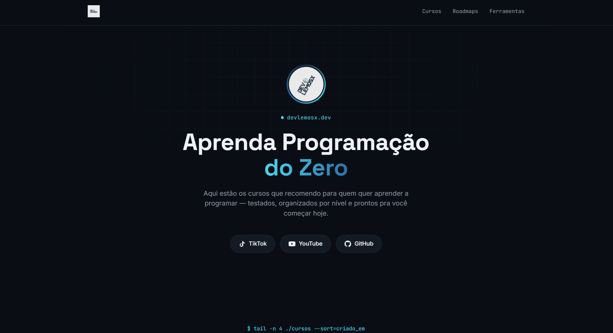
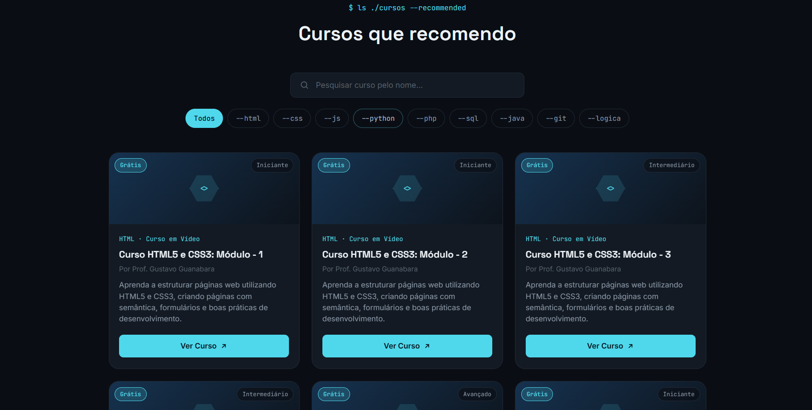
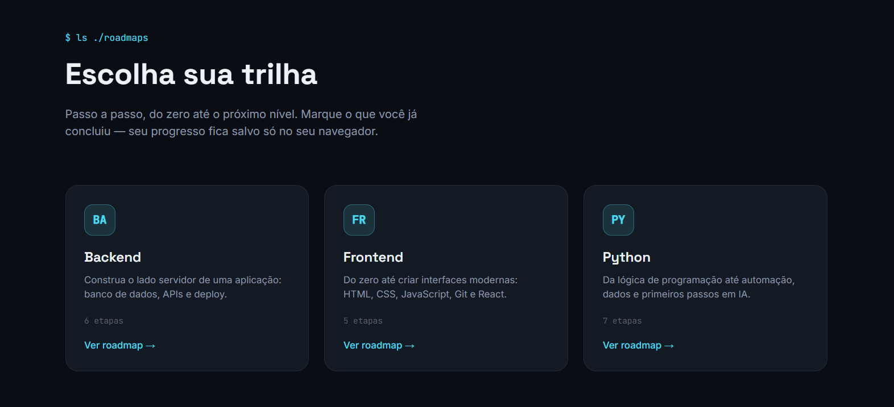

# 🚀 DevLemosx

> Cursos, roadmaps e projetos para quem quer aprender programação — tudo em um só lugar.

Site criado para centralizar o link da bio do [TikTok](https://tiktok.com/@devlemosx) / YouTube / GitHub do DevLemosx, reunindo cursos recomendados, trilhas de aprendizado (roadmaps) e conteúdo pra quem tá começando na programação.


---

## 📸 Preview

<p align="center">
  
  
  
</p>

---

## 💡 Sobre o projeto

O DevLemosx nasceu como uma alternativa a colocar vários links soltos de afiliado na bio do TikTok. Em vez disso, virou uma plataforma que reúne cursos recomendados, roadmaps de aprendizagem por tecnologia, projetos práticos pra treinar e conteúdo sobre o mercado de programação — tudo isso servido por um back-end simples (Supabase) sem precisar de servidor próprio.

O projeto também serviu como prática real de modelagem de banco de dados, segurança de dados com Row Level Security, geração de arquivos (PDF), rastreamento de eventos e organização de um projeto front-end que cresceu bastante sem virar bagunça.

---

## ✨ Funcionalidades

- 🔎 Busca em tempo real e filtro por tecnologia (incluindo por tags)
- 📚 Catálogo de cursos dinâmico (Supabase) — grátis ou pago, com nível, nota, carga horária e idioma
- ❤️ Favoritar cursos (salvo no navegador, sem precisar de login)
- 🗺️ Roadmaps de aprendizagem (Frontend, Backend, Python) com progresso marcável por etapa
- 🔗 Compartilhar roadmap (Web Share API com fallback pra copiar link)
- 📥 Download dos roadmaps em PDF, gerado a partir dos dados reais do banco
- 🧩 Páginas de tecnologia (o que é, mercado, faixa salarial, cursos e projetos relacionados)
- 💻 Projetos pra praticar, com checklist de requisitos marcável
- 📰 Página de novidades — changelog automático a partir do banco, com resumo semanal e filtro por tipo
- 📧 Captura de e-mail (newsletter), sem travar nenhum conteúdo atrás de cadastro
- 📊 Rastreamento de cliques em cursos, downloads de PDF e visualizações de página
- 📈 Dashboard privado com rankings agregados (não linkado publicamente)
- 🛠️ Seção de ferramentas recomendadas

---

## 🛠️ Tecnologias utilizadas

**Front-end**
- HTML5, CSS3, JavaScript (vanilla — sem framework)

**Back-end / Dados**
- [Supabase](https://supabase.com) (PostgreSQL + API automática + Row Level Security)

**Geração de PDF** *(offline, não faz parte do site em produção)*
- Python + [ReportLab](https://www.reportlab.com/) — gera os PDFs dos roadmaps a partir dos mesmos dados cadastrados no banco

**Deploy**
- Netlify ou GitHub Pages (qualquer hospedagem de site estático funciona)

Não usei nenhum framework de front-end (React, Vue etc.) porque o projeto não chegou a precisar — o JavaScript puro dá conta do estado de cada página.

---

## 🏗️ Arquitetura

O site é estático (sem servidor próprio) e fala direto com o Supabase pelo navegador, usando a **publishable key** (antiga "anon key") — que é segura de expor publicamente porque quem protege os dados de verdade é a Row Level Security (RLS) configurada em cada tabela, não o sigilo da chave.

```text
Navegador (HTML/CSS/JS)
   │
   ▼
Supabase JS Client  (chave publishable)
   │
   ▼
PostgreSQL + Row Level Security
```

Duas regras de acesso diferentes convivem no mesmo banco:

- **Tabelas de conteúdo** (`cursos`, `roadmaps`, `roadmap_etapas`, `tecnologias`, `projetos`) → leitura pública, sem escrita pública.
- **Tabelas de evento** (`leads`, `cliques`, `downloads_pdf`, `visualizacoes`) → o oposto: **qualquer um pode inserir** (é assim que o site registra e-mails/cliques), mas **ninguém consegue ler** pela chave pública — nem e-mail, nem clique individual. Só o dono do projeto vê isso pelo painel do Supabase.

Pra mostrar analytics de forma pública/segura mesmo assim, o dashboard não lê essas tabelas diretamente — ele lê 6 **views agregadas** (ex: `ranking_cursos_cliques`), que só devolvem contagens totais, nunca o dado individual.

---

## 📁 Estrutura do projeto

```text
devlemosx/
├── index.html              # Home: hero, busca, cursos, tecnologias, ferramentas
├── roadmaps.html            # Lista de roadmaps
├── roadmap.html              # Detalhe de um roadmap (?slug=)
├── tecnologia.html           # Página de uma tecnologia (?slug=)
├── downloads.html            # PDFs dos roadmaps (página estática, indexável)
├── novidades.html            # Changelog automático
├── dashboard.html            # Analytics privado (não linkado no menu)
│
├── style.css                 # Todo o CSS do site
│
├── script.js                 # Lógica da home (cursos, busca, filtros, favoritos)
├── roadmaps.js
├── roadmap.js
├── tecnologia.js
├── downloads.js
├── novidades.js
├── dashboard.js
├── nav.js                    # Menu suspenso do cabeçalho
├── newsletter.js              # Captura de e-mail (compartilhado entre páginas)
│
├── assets/
│   ├── logo.jpg
│   └── pdfs/                 # Roadmaps em PDF, gerados a partir do banco
│
├── cursos.json               # Backup local do catálogo (não usado em produção)
│
└── sql/                       # Todas as migrations do banco, em ordem
    ├── 01_cursos_inicial.sql
    ├── 02_cursos_campos_extras.sql
    ├── 03_cursos_catalogo_real.sql
    ├── 04_roadmaps.sql
    ├── 05_tecnologias.sql
    ├── 06_tecnologias_data_salario.sql
    ├── 07_projetos_praticar.sql
    ├── 08_leads_e_cliques.sql
    ├── 09_analytics_downloads.sql
    └── 10_dashboard_views.sql
```

---

## 🗺️ Roadmap do projeto

- [x] Landing page
- [x] Catálogo de cursos dinâmico (Supabase)
- [x] Roadmaps com progresso salvo localmente
- [x] Páginas de tecnologia
- [x] Projetos pra praticar com checklist
- [x] Favoritar cursos
- [x] Download dos roadmaps em PDF
- [x] Newsletter (captura de e-mail)
- [x] Rastreamento de cliques e downloads
- [x] Página de novidades (changelog automático)
- [x] Dashboard privado com analytics agregado
- [ ] Comparador de cursos
- [ ] Página de carreiras
- [ ] Quiz "O que aprender agora?"
- [ ] Menu de navegação funcional no celular

---

## 🚀 Executando localmente

**1. Clone o repositório**
```bash
git clone https://github.com/DevLemosx/devlemosx.git
cd devlemosx
```

**2. Crie seu próprio projeto no Supabase**

Crie uma conta gratuita em [supabase.com](https://supabase.com) e um projeto novo. Depois, rode os arquivos da pasta `sql/` **na ordem numérica**, colando cada um no SQL Editor do Supabase.

**3. Configure suas credenciais**

Pegue a **Project URL** e a **publishable key** em *Project Settings → API* do seu projeto Supabase, e cole nas constantes `SUPABASE_URL` e `SUPABASE_ANON_KEY` no topo de cada arquivo `.js` (`script.js`, `roadmap.js`, `roadmaps.js`, `tecnologia.js`, `novidades.js`, `downloads.js`, `dashboard.js`).

> ⚠️ Use sempre a **publishable key** (segura pro navegador, por causa da RLS). **Nunca** use a *secret key* aqui — essa é só pra backend/servidor e nunca deve ir pro navegador nem pro GitHub.

**4. Rode o site**

Como o site busca dados de uma API externa, abrir o `index.html` direto (`file://`) não funciona — use um servidor local (ex: extensão *Live Server* do VS Code) ou publique direto no Netlify/GitHub Pages.

---

## 📚 O que aprendi

Durante o desenvolvimento do DevLemosx, pratiquei:

- Modelagem de banco de dados relacional com PostgreSQL
- Row Level Security — controlar exatamente quem lê/escreve o quê, sem precisar de um sistema de login
- Expor analytics de forma segura usando *views* agregadas em vez das tabelas cruas
- Consumo de API (Supabase JS client) direto do front-end, sem back-end próprio
- Geração de arquivos PDF programaticamente com Python (ReportLab), a partir de dados reais do banco
- Persistência de estado no navegador com `localStorage` (progresso, favoritos) sem precisar de conta de usuário
- Rastreamento de eventos (cliques, downloads, visualizações) pra decisões guiadas por dados
- Organização de um projeto multi-página que cresceu bastante, mantendo o código previsível

---

## 👨‍💻 Autor

**Guilherme Lemos**

- TikTok: [@devlemosx](https://tiktok.com/@devlemosx)
- GitHub: [github.com/DevLemosx](https://github.com/DevLemosx)
- YouTube: [youtube.com/@devlemosx](https://youtube.com/@devlemosx)
- LinkEndIn: [linkedin.com/Guilherme](www.linkedin.com/in/lemos-guilherme)


